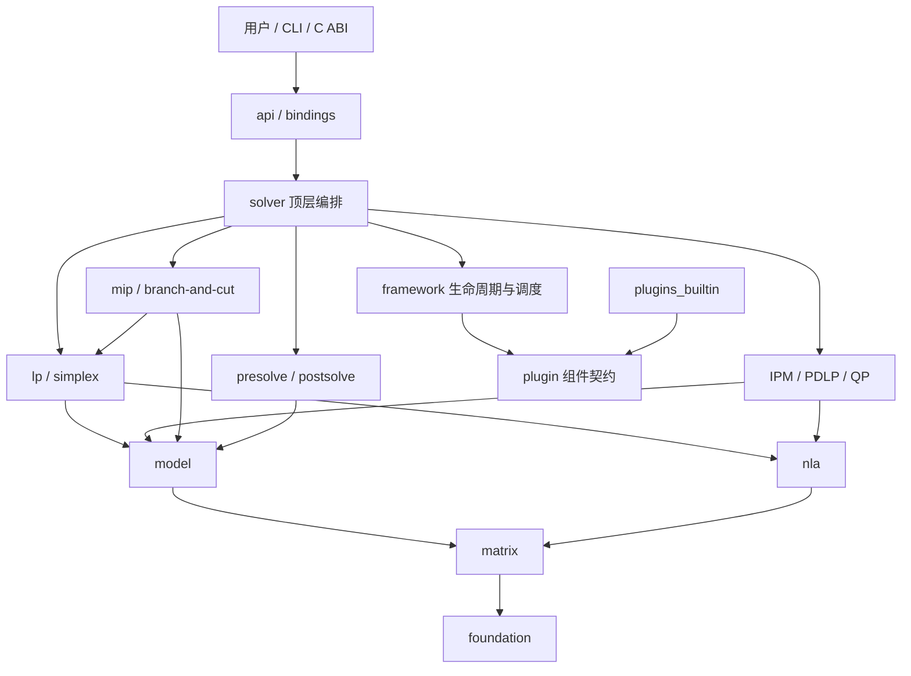

# zhighs

`zhighs` 是一个使用 Zig 实现的线性与混合整数优化求解器项目。项目以
[HiGHS](https://github.com/ERGO-Code/HiGHS) 的高性能算法内核为复现目标，
并借鉴 [SCIP](https://www.scipopt.org/) 的阶段管理、组件注册和插件调度方式组织代码。

当前项目处于基础设施阶段，已经实现可配置整数类型、强类型 `RowId/ColId`、紧凑可选 ID、双精度类型 `HD`、
双双精度类型 `HCD` 及其单元测试和性能基准。尚未实现的求解模块不会预先建立空目录，
而是在对应里程碑开始时加入。

## 架构概览



依赖只能沿图中箭头向下。算法组件通过 `Services` 使用核心能力，不直接依赖完整的
求解器对象；Simplex 的 pivot、pricing、FTRAN/BTRAN 等热路径不使用动态插件调用。

## 文档导航

| 文档 | 内容 |
|---|---|
| [`docs/architecture.md`](docs/architecture.md) | zhighs 的目标分层、数据所有权和组件边界。 |
| [`docs/highs-zhighs-file-map.md`](docs/highs-zhighs-file-map.md) | HiGHS C++ 与 zhighs Zig 的逐功能文件对应表及实现状态。 |
| [`docs/highs-module-architecture.md`](docs/highs-module-architecture.md) | HiGHS 当前模块组织、求解流程和子系统关系的详细中文图解。 |
| [`todo.md`](todo.md) | zhighs 按依赖顺序执行的实现清单和验收标准。 |

## 当前目录

```text
zhighs/
├── build/                  # Zig 构建辅助模块
│   └── foundation.zig     # foundation 模块及其配置、测试构建
├── bench/                  # 独立性能基准
│   └── hcd/               # HCD 与 HiGHS HighsCDouble 对照基准
├── docs/                   # 长期维护的设计文档
│   └── architecture.md    # 模块边界、所有权和组件约束
├── src/                    # 库和命令行程序源码
│   ├── foundation/        # 无业务依赖的基础类型和数值设施
│   ├── matrix/            # 矩阵与稀疏数据结构
│   ├── model/             # LP/MIP/QP 模型、解和 basis
│   ├── nla/               # 数值线性代数与 basis factorization
│   ├── lp/simplex/        # LP 公共状态与 revised simplex
│   ├── presolve/rules/    # Presolve、postsolve 和内置 reduction
│   ├── mip/               # Branch-and-cut
│   ├── ipm/ pdlp/ qp/    # 其他求解器族
│   ├── framework/ plugin/ # 生命周期、调度和组件契约
│   ├── plugins_builtin/   # 内置组件实现
│   ├── solver/ api/       # 顶层编排与稳定 Zig API
│   ├── analysis/          # KKT、IIS、ranging 和证书
│   ├── io/ diagnostics/   # 文件格式、日志和统计
│   ├── parallel/ bindings/# 并行设施与 C ABI
│   ├── root.zig           # zhighs 公共库入口
│   └── main.zig           # 命令行程序入口
├── test/                   # 差分、模糊、实例和回归测试规划
├── vendors/               # 必要时存放受控的第三方源码
├── build.zig              # 顶层构建、测试和基准任务
├── build.zig.zon          # Zig 包元数据与依赖声明
├── todo.md                # 近期实现任务
└── LICENSE                # 项目许可证
```

### 文件夹职责

| 文件夹 | 职责 | 依赖约束 |
|---|---|---|
| `src/` | 所有可发布的库源码和 CLI 入口。 | 不放基准、生成文件或第三方源码。 |
| `src/foundation/` | 基础整数类型、强类型 ID、紧凑 optional ID、浮点与扩展精度数值、常量、容差、计时和内存辅助设施。当前包含 `HInt/HUInt/RowId/ColId/HD/HCD`。 | 只能依赖 Zig 标准库和构建配置，不能依赖模型或求解器。 |
| `src/matrix/` | 稀疏向量、MultiArrayList SoA 构建、权威 CSC、revision-aware CSR、乘加/HCD product、数值评估、范数、转置、切片、scaling、permutation、结构编辑、动态行和 `MatrixStore`。 | 可以依赖 `foundation`，不能依赖 LP、MIP 或插件。 |
| `src/model/` | LP/MIP/QP 模型、Hessian、多目标、变量类型、解、basis、ray 和模型构建器。当前仅建立模块边界；不会用只有矩阵内容的结构冒充 `LpModel`。 | 依赖 `matrix/foundation`，不依赖具体求解算法。 |
| `src/nla/` | 稠密/稀疏 LU、basis factorization、FTRAN/BTRAN、更新和奇异恢复。 | 依赖 `matrix/foundation`，不读取顶层 solver。 |
| `src/lp/` | LP engine 的共同状态、结果与调用约定。 | 依赖 `model/nla`，供 solver 和 MIP relaxation 使用。 |
| `src/lp/simplex/` | Primal/dual revised simplex、Phase I/II、pricing、ratio test、crash 和 warm start。 | 热循环保持静态调用，不依赖运行期插件。 |
| `src/presolve/` | 模型简化、reduction 记录、postsolve、basis/证书恢复。 | 依赖 `model`，每项变换必须可逆或显式标记恢复能力。 |
| `src/presolve/rules/` | 内置 presolve 规则。 | 规则不能绕过 postsolve stack 修改模型。 |
| `src/mip/` | LP relaxation、节点、domain、cuts、conflicts、implications、pseudo-cost 和 incumbent。 | 依赖 LP/model/framework，不反向进入基础层。 |
| `src/ipm/` | 内点法、KKT 系统、crossover 和公共结果转换。 | 延后实现；复用 model/nla。 |
| `src/pdlp/` | PDHG/PDLP、scaling、步长、restart 和终止条件。 | 延后实现；不能作为需要 basis 的 MIP 节点主求解器。 |
| `src/qp/` | 凸 QP Hessian 处理和 active-set 求解器。 | 延后实现；复用 model/nla。 |
| `src/framework/` | Stage、Registry、Scheduler、Event、结果码和受限 Services。 | 只负责编排组件，不实现具体割或启发式。 |
| `src/plugin/` | constraint/presolve/separation/propagation/branching/heuristic/pricer/Benders/conflict/IIS/node/cut/event/reader 等组件契约。 | 契约不能暴露完整 Solver 的可变访问。 |
| `src/plugins_builtin/` | 随库发布的上述组件实现。 | 实现依赖 `plugin` 契约，通过 framework 注册。 |
| `src/solver/` | 持有 incumbent model，完成校验、presolve、算法选择、postsolve、限制和最终状态发布。 | 是编排层，不吸收各算法内部状态。 |
| `src/api/` | 稳定 Zig API、选项、状态、回调和结果访问。 | 只通过 solver facade 操作内部模块。 |
| `src/analysis/` | KKT、IIS、ranging、ray、灵敏度、病态性和 feasibility relaxation。 | 分析算法消费只读状态或明确的分析工作区。 |
| `src/io/` | MPS/LP、basis、solution 和 option 文件。 | parser 产生 builder，不直接修改求解器私有状态。 |
| `src/diagnostics/` | 日志、计时、统计、trace 和 debug consistency check。 | 只观察，不改变数值决策。 |
| `src/parallel/` | 可选任务调度、同步、取消和确定性控制。 | 串行路径始终可用。 |
| `src/bindings/` | 基于 `api` 的稳定 C ABI，以及后续语言绑定入口。 | 不直接导出内部 struct 布局。 |
| `build/` | 拆分 `build.zig` 中可复用的模块构建逻辑，避免顶层构建文件持续膨胀。 | 只参与构建，不进入运行时库。 |
| `bench/` | 可重复运行的性能基准及基准结果说明。 | 基准可以依赖库模块，库源码不能反向依赖基准。 |
| `bench/hcd/` | Zig `HCD` 与 HiGHS `HighsCDouble` 的微基准和历史结果。 | 不作为正确性测试替代品。 |
| `docs/` | 架构、设计决策和面向维护者的长期文档。 | README 保持入门友好，详细约束放在这里。 |
| `vendors/` | 仅在无法通过 Zig 包管理或系统依赖使用时，保存固定版本的第三方源码。 | 每个依赖必须记录来源、版本和许可证；项目代码不能在此实现业务逻辑。 |
| `test/` | HiGHS 差分、fuzz、回归与可再分发小实例。 | 性能测试放在 `bench/`。 |

`.zig-cache/`、`zig-cache/` 和 `zig-out/` 是 Zig 自动产生的缓存或构建输出，
已被 Git 忽略，不属于源码架构。

## 模块实现状态

核心模块边界现已创建并接入编译；“骨架”表示职责和入口已存在，但算法尚未实现：

| 状态 | 模块 |
|---|---|
| 已实现 | `foundation` 中的整数、强类型 ID、`HD/HCD`；`matrix` 中的稀疏向量、SoA 构建、CSC/CSR、MatrixStore、乘法、稳定范数、转置、切片、scaling、permutation、结构编辑、动态行和稀疏累加。 |
| 骨架 | `matrix` 的 scaling 后续部分，以及 `model/nla/lp/simplex/presolve/analysis/mip/framework/plugin/solver/api/io/diagnostics`。 |
| 延后骨架 | `ipm/pdlp/qp/parallel/bindings/plugins_builtin`。 |

## 与本地 HiGHS 的模块对应

本轮结构审计基于本机 `/home/godv/documents/codefiles/cppfiles/HiGHS`，当前源码标识为
`v1.14.0-4-gdcc25308d8-dirty`。Zig 侧按职责重新分层，不逐目录照搬：

| HiGHS C++ | zhighs | 说明 |
|---|---|---|
| `Highs.h`, `lp_data/Highs*.cpp` | `api/`, `solver/`, `model/` | 拆开公共 API、求解编排和数据对象，避免上帝类。 |
| `lp_data/HighsIis`, `HighsRanging`, solution checks | `analysis/` | IIS、ranging、KKT、ray 和结果评估独立。 |
| `util/HighsInt`, `HighsCDouble`, containers | `foundation/` | 无求解器依赖的底层能力。 |
| `util/HighsSparseMatrix`, matrix helpers | `matrix/` | 权威 CSC、缓存 CSR、动态行和 scaling 分离。 |
| `util/HFactor`, `simplex/HSimplexNla` | `nla/` | factorization 不放在通用 util。 |
| `simplex/` | `lp/simplex/` | Primal/dual revised simplex 主线。 |
| `presolve/` | `presolve/`, `presolve/rules/` | 强制 reduction 与 postsolve 成对实现。 |
| `mip/` | `mip/`, `plugins_builtin/` | 树和状态留在 MIP；策略逐步组件化。 |
| `ipm/`, `pdlp/`, `qpsolver/` | `ipm/`, `pdlp/`, `qp/` | 保留完整产品边界，但延后实现。 |
| `io/` | `io/`, `diagnostics/` | 文件转换与日志/统计分开。 |
| `parallel/` | `parallel/` | 可选并行设施，不污染串行算法。 |
| `interfaces/`, `highspy/` | `bindings/` | 先稳定 C ABI，再扩展语言绑定。 |
| `test_kkt/` | `analysis/`, `test/` | KKT 实现在分析层，实例和对照放测试层。 |
| HiGHS 无直接对应 | `framework/`, `plugin/` | SCIP 式生命周期、注册和组件契约。 |

## 公开入口

外部代码应导入 `zhighs`，不要直接依赖内部文件路径：

```zig
const zhighs = @import("zhighs");

const Index = zhighs.HInt;
const Extended = zhighs.HCD;
```

`src/root.zig` 是公共导出面的唯一来源。目录迁移时只要这里的公开名称保持稳定，
调用方就不需要跟随内部布局变化。旧的 `zhighs.types` 作为兼容别名保留，新增代码应使用
`zhighs.foundation` 或顶层导出的类型名称。

## 构建与验证

项目当前要求 Zig `0.16.0`：

```bash
# 构建可执行程序
zig build

# 使用默认 32 位 HInt 运行全部测试
zig build test

# 验证 64 位 HInt 配置
zig build test -Dhighs-int-width=w64

# 运行 HCD 微基准
zig build bench-hcd -Doptimize=ReleaseFast
```

HCD 与本机 HiGHS C++ 实现的对照环境及历史数据记录在
[`bench/hcd/results.md`](bench/hcd/results.md)。

## 后续实现顺序

1. 创建真正包含目标方向、目标系数、行列上下界和变量类型的 `LpModelBuilder -> LpModel`。
2. 完成顶层 `Model`、`Solution`、`Basis` 和 KKT 检查。
3. 建立小规模 reference simplex，用 HiGHS C API 做差分测试。
4. 实现 sparse factorization、primal/dual revised simplex 和 warm start。
5. 实现可逆的 presolve/postsolve。
6. 在真实 LP 状态流基础上加入 Stage、Registry 和 Services。
7. 实现最小 branch-and-bound，再逐步加入 cuts 与启发式组件。

详细任务以 [`todo.md`](todo.md) 为准。新增模块时应同步更新本 README 的目录职责、
依赖关系及 HiGHS 文件对应表。
