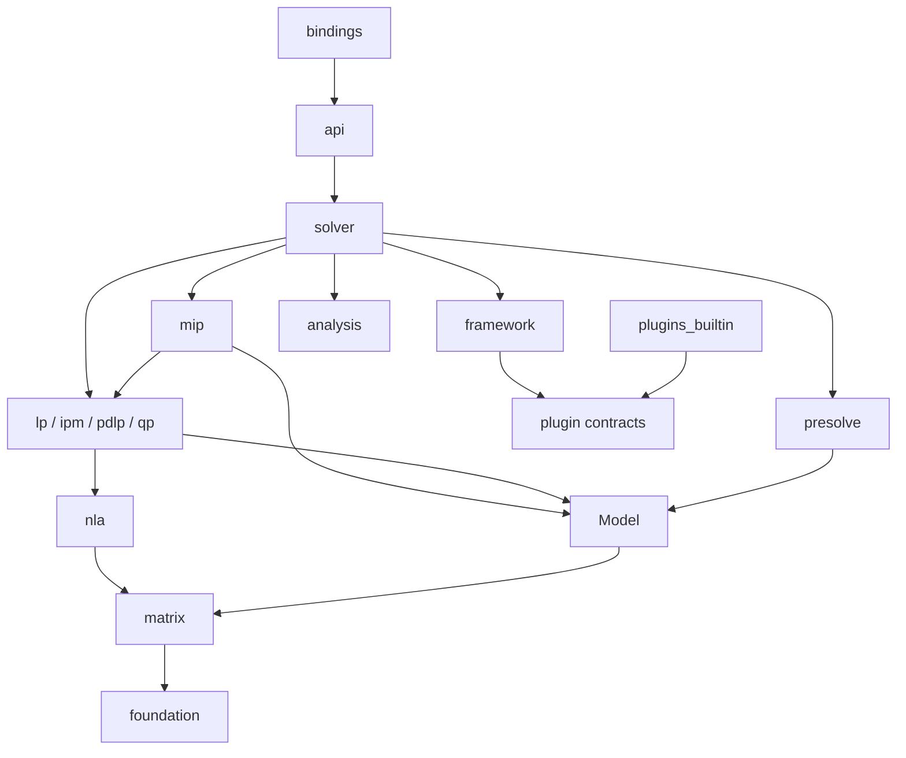

# zhighs 架构约束

本文记录 README 之外需要长期遵守的模块边界。算法路线和当前任务见
[`../todo.md`](../todo.md)。

相关资料：

- [`highs-zhighs-file-map.md`](highs-zhighs-file-map.md)：两个项目的功能文件对应关系；
- [`highs-module-architecture.md`](highs-module-architecture.md)：HiGHS 当前架构详细图解。

## 设计目标

- 复现 HiGHS 的高性能 LP/MIP 算法与数值行为。
- 使用 SCIP 式阶段、注册和调度机制组织可替换算法组件。
- 保持数值热路径静态、紧凑、可测，不为组件化牺牲内层循环性能。
- 通过 HiGHS C API 差分测试验证行为，而不是按 C++ 文件逐行翻译。

## 分层



任何反向依赖都必须先重新设计接口，不能用导入整个上层模块的方式绕过。

## 数据所有权

| 对象 | 所有者 | 生命周期 |
|---|---|---|
| `Model` | API/solver | 从模型冻结到求解器清空 |
| CSC 基础矩阵 | `Model` | 与冻结模型一致 |
| CSR view | matrix cache | 基础矩阵版本变化时失效 |
| `LpState` | LP engine | 单次 LP 会话，可用于 warm start |
| factorization | `LpState` | basis 变化时更新或重建 |
| `MipState` | MIP solver | 单次 MIP 求解 |
| 动态 cuts | cut pool / relaxation | 可回收，不修改基础 CSC |
| 插件上下文 | registry | 从插件注册到 registry 释放 |

禁止让 `Model` 同时持有 simplex 临时数组、节点树和 cut pool。

## 数值约束

- 模型、矩阵、解和 factorization 的标量固定使用 `f64`。
- `HCD` 用于目标值、点积、残差等敏感累加，不把整个求解器泛型化为任意实数。
- `HInt` 是公开/模型索引类型；访问 Zig slice 前必须 checked 转换为 `usize`。
- 容差通过统一 policy 传递，算法文件不能散落未命名的 `1e-N` 常量。
- fast-math 必须局部、显式启用；正确性和残差检查保持严格浮点语义。

## 矩阵约束

- 输入经 `MatrixBuilder` 规范化后冻结为 CSC。
- CSC 中索引有序、无重复项、无显式零。
- CSR 是可重建视图，不与 CSC 同时作为可变权威数据。
- `MatrixStore` 统一拥有 CSC、matrix revision 和按需 CSR cache；模型层只组合它，不重复实现缓存生命周期。
- scaling、切片和算法工作区与基础存储分离。
- MIP cuts 使用动态行存储，批量合并时才重建 relaxation 矩阵。

## 组件边界

插件元数据至少包含：

```text
name, priority, frequency, max_depth, lifecycle, execute
```

执行函数返回 tagged union，明确表达：未运行、无结果、添加 cuts、缩紧域、产生分支或
cutoff。调度器不能依赖日志文本推断执行结果。

插件只能通过 `Services` 获取当前阶段允许的能力，例如：

- 读取 relaxation solution；
- 提交 cut 候选；
- 请求 domain tightening；
- 提交 incumbent；
- 发布求解事件。

插件不能：

- 直接持有完整 `Solver`；
- 修改基础模型的内部 slice；
- 绕过 domain stack 修改节点边界；
- 在 pivot/FTRAN/BTRAN 内层循环引入运行期 vtable 调用。

内置 hot-path 策略优先使用 Zig `comptime` 组合；`*anyopaque + vtable` 只用于调度频率
较低、确实需要运行期替换的组件。

## 阶段

首版阶段机保持精简：

```text
empty -> problem -> transformed -> presolving -> presolved
      -> solving -> solved -> deinitialized
```

所有公开 API 和插件服务都必须声明允许阶段，并对非法调用返回结构化错误。

## 测试边界

- 小型单元测试与源码同文件维护。
- `test/differential/` 对照 HiGHS C API。
- `test/fuzz/` 覆盖模型构建、矩阵规范化和 presolve。
- `test/regression/` 固定曾出现错误的最小实例。
- `bench/` 只衡量性能，不能替代正确性断言。

比较求解结果时至少检查状态、目标值、primal/dual residual、互补性和 basis 有效性。

## HiGHS 覆盖边界

结构完整性以本机 HiGHS `dcc25308d8` 为参照。首版架构必须能容纳以下能力，即使算法
按里程碑延后实现：

- LP：primal/dual revised simplex、IPM、PDLP、basis 和 crossover；
- MIP：branch-and-cut、domain、cuts、conflicts、implications 和 heuristics；
- QP：Hessian 和 convex active-set solver；
- solve pipeline：模型修改、选项、presolve/postsolve、solver selection 和 callbacks；
- analysis：KKT、rays、IIS、ranging、feasibility relaxation 和 solution assessment；
- infrastructure：MPS/LP I/O、日志、统计、并行设施和稳定 C ABI。

SCIP 式组件化只作用于低频策略边界；它不替代 model、NLA、simplex state 或 MIP tree
这些拥有明确数据所有权的核心对象。
