# HiGHS 模块组织与运行流程图解

本文只描述本机 HiGHS C++ 项目的实际组织方式，用于阅读上游源码和指导 zhighs 移植。
zhighs 自身的目标架构见 [`architecture.md`](architecture.md)，逐文件对应关系见
[`highs-zhighs-file-map.md`](highs-zhighs-file-map.md)。

## 0. 审计基线与读图约定

- 源码路径：`/home/godv/documents/codefiles/cppfiles/HiGHS`
- 源码标识：`v1.14.0-4-gdcc25308d8-dirty`
- 核心源码根目录：`highs/`
- 箭头 `A --> B` 表示 A 调用、持有或依赖 B；不等同于 C++ 的单个 `#include`。
- 实线节点是 HiGHS 当前存在的模块；图中的“检查/路由”等节点表示跨文件的逻辑职责。

HiGHS 的目录看起来按算法划分，但 `lp_data/` 实际同时承担公共数据、用户 API 和顶层调度，
而 `util/` 同时包含真正的通用工具、稀疏矩阵和 Simplex factorization。因此读源码时不能只按
目录名判断依赖层次。

## 1. 总体模块组织

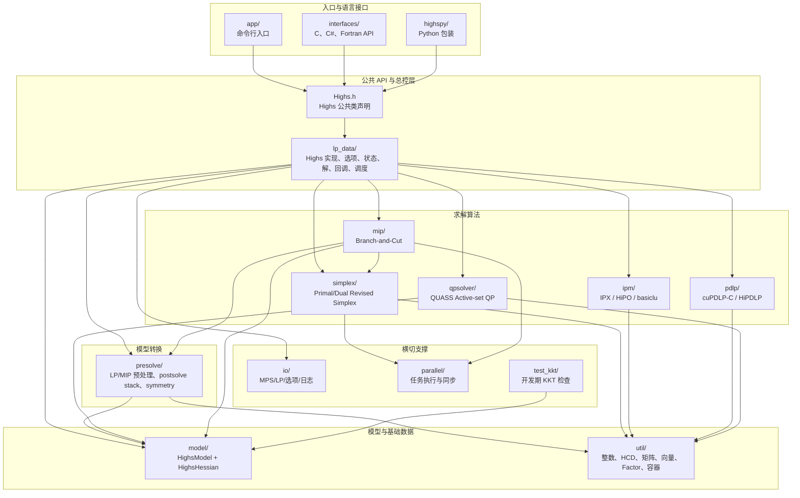

### 图中模块的真实职责

| 模块 | 核心职责 | 关键文件 | 需要特别注意 |
|---|---|---|---|
| `Highs.h` | 声明用户看到的 `Highs` 类和大量模型/求解 API。 | `highs/Highs.h` | 公共接口很宽，同时暴露 LP、MIP、QP、IIS、ranging 等能力。 |
| `lp_data/` | 模型操作、状态、选项、回调、解、总控和算法路由。 | `Highs.cpp`, `HighsInterface.cpp`, `HighsSolve.cpp` | 名称像“数据层”，实际是总控中心。 |
| `model/` | 把 LP 和 Hessian 组合成 `HighsModel`。 | `HighsModel.*`, `HighsHessian.*` | 普通 LP 数据本身仍定义在 `lp_data/HighsLp.*`。 |
| `util/` | 数值类型、矩阵、向量、容器、计时和 basis factorization。 | `HighsSparseMatrix.*`, `HVector*`, `HFactor*` | `HFactor` 是 Simplex NLA，不是普通工具；存在层次反转。 |
| `presolve/` | 简化模型并记录逆变换，求解后恢复原模型解。 | `HPresolve.*`, `HighsPostsolveStack.*` | MIP 还会走 `HighsMipSolver::runMipPresolve`。 |
| `simplex/` | Primal/dual revised simplex、basis/NLA 管理。 | `HEkk*`, `HSimplex*` | MIP LP relaxation 的关键底座。 |
| `mip/` | Branch-and-cut 的树、域、cuts、启发式、冲突和传播。 | `HighsMipSolver*`, `HighsSearch*` | 多数策略是具体类或内嵌逻辑，不是统一插件。 |
| `ipm/` | IPX/HiPO 内点法及 crossover。 | `IpxWrapper.*`, `ipx/*`, `hipo/*` | 可能返回 basis；异常状态可触发 Simplex cleanup。 |
| `pdlp/` | 一阶 primal-dual 方法。 | `CupdlpWrapper.*`, `HiPdlpWrapper.*` | 通常不产生供 MIP 重优化使用的 basis。 |
| `qpsolver/` | 凸 QP active-set 求解。 | `quass.*`, `a_asm.*` | 使用 Hessian、reduced gradient、pricing 和 ratio test。 |
| `io/` | 文件格式、选项文件和日志。 | `Filereader*`, `HMPSIO*`, `HighsIO*` | 日志与文件解析位于同一目录。 |
| `parallel/` | task executor、work deque、锁和信号量。 | `HighsTaskExecutor.*`, `HighsSplitDeque.h` | 主要服务并行算法路径，串行求解仍可工作。 |

## 2. `Highs` 对象的数据所有权

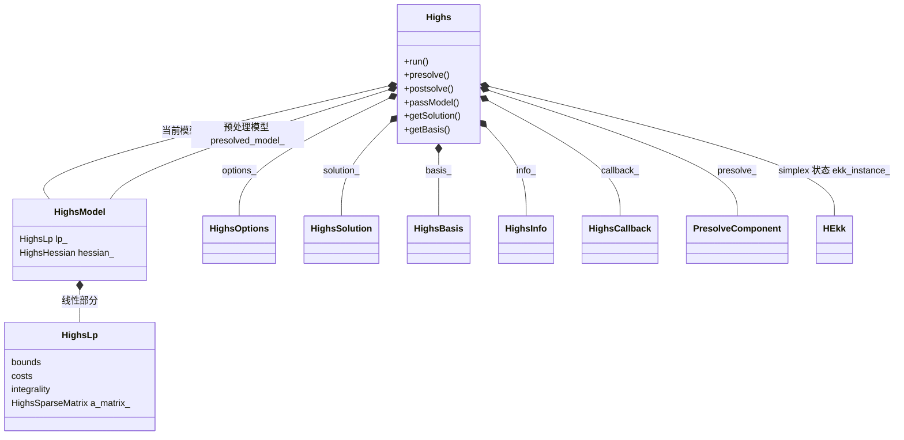

### 所有权注释

1. `Highs` 既是用户 facade，也是求解会话状态的主要所有者。
2. `model_` 保存当前原模型；`presolved_model_` 保存简化后的模型。
3. `solution_`、`basis_`、`info_` 会被不同求解器路径回写。
4. `ekk_instance_` 允许 Simplex 状态跨调用保留，从而支持 basis warm start 和重优化。
5. `presolve_` 同时保存 reduced model、postsolve stack 和恢复中的 solution/basis。
6. 这种集中所有权方便公共 API，但也使 `Highs.cpp` 必须协调大量条件和恢复路径。

## 3. `Highs::run()` 的外层生命周期

HiGHS 自己在 `HighsRun.md` 中说明，`run()` 随功能增加已经承担过多职责，并计划逐步拆成
`run -> optimizeHighs -> optimizeModel`。下图同时表示当前行为和文档中的逻辑分层。

```mermaid
sequenceDiagram
    autonumber
    actor User as 用户/接口
    participant Run as Highs::run
    participant Outer as 外层动作
    participant Opt as optimizeHighs / optimizeModel
    participant Pre as Presolve
    participant Route as 求解器路由
    participant Post as Postsolve与检查

    User->>Run: run()
    Run->>Outer: 读取可执行型文件选项
    Outer->>Outer: 应用用户 objective/bound scaling
    Outer->>Opt: 进入模型优化层
    Opt->>Opt: 处理 infinite cost 与 semi-variable mods

    alt 存在多个线性目标
        Opt->>Opt: multiobjectiveSolve()
        Note over Opt: 按 priority/weight/tolerance<br/>执行一系列子问题
    else 单目标
        Opt->>Pre: 判断并运行 presolve
        Pre-->>Opt: reduced model + postsolve stack
        Opt->>Route: 根据 LP/MIP/QP 与 options 选择算法
        Route-->>Opt: status + solution + basis + info
        Opt->>Post: 恢复原模型解并检查数值质量
        Post-->>Opt: 原模型 solution/basis/status
    end

    Opt-->>Outer: 求解结果
    Outer->>Outer: 撤销 mods 与用户 scaling
    Outer->>Outer: 写 solution/basis/IIS 等文件
    Run-->>User: HighsStatus
```

### 为什么需要“撤销”

- 用户 scaling 只应在最外层应用一次，嵌套子求解不能重复缩放。
- infinite objective cost 会临时变成固定变量，返回前必须恢复原 cost/bounds。
- semi-continuous/semi-integer 变量可能被修正或 reformulate，返回前要恢复用户模型语义。
- presolve 解的是 reduced model，必须通过 postsolve stack 恢复到原始行列空间。

## 4. 模型类型与求解器路由

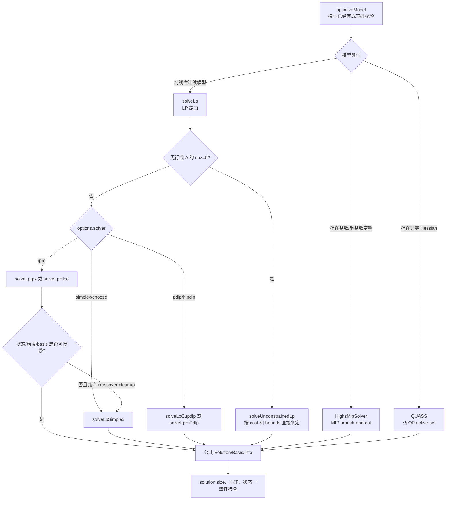

### 路由注释

- `HighsSolve.cpp::solveLp` 是 LP 算法选择的集中入口。
- 无约束 LP 不进入迭代求解器，而是根据 cost、lower、upper 直接构造解并判断无界/不可行。
- IPM 和 PDLP 返回的数据最终要转换成公共 `HighsSolution/HighsBasis/HighsInfo`。
- IPM 结果状态不理想且允许 cleanup 时，会再次调用 Simplex。
- MIP 会在内部反复调用 LP relaxation；这不是简单的一次 `solveLp`。

## 5. Revised Simplex 内部组织

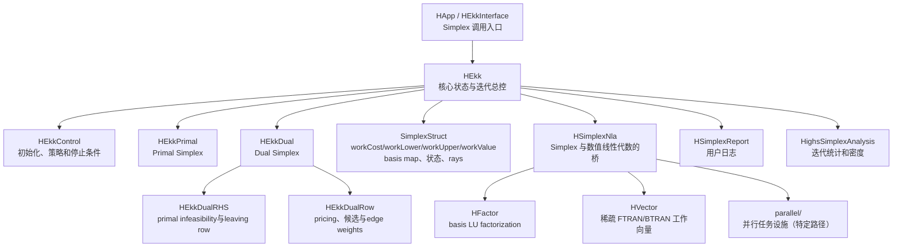

### 一次典型 Revised Simplex 迭代

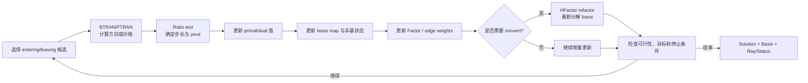

关键点：

- `B` 是当前 basis 矩阵，FTRAN 近似计算 `B^-1 a_q`，BTRAN 近似计算 `B^-T e_p`。
- `HVector` 使用 dense 数值数组配合稀疏 index 集，减少清零和扫描成本。
- `HFactor` 虽位于 `util/`，实际是 Simplex 最关键的数值内核之一。
- MIP 节点修改 bounds 后通常更适合 dual simplex warm start，因此 dual 路径是 MIP 性能关键。

## 6. Presolve 与 Postsolve

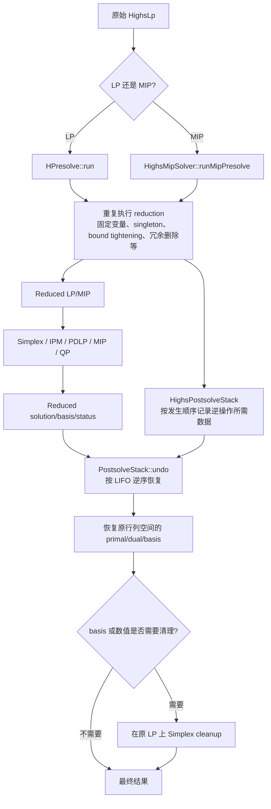

### Presolve 状态与数据

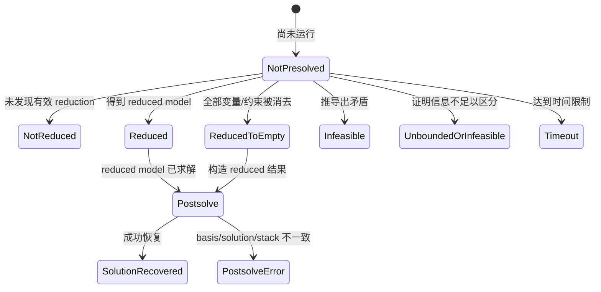

实现 reduction 时必须同时考虑：primal value、dual value、row activity、basis status、
infeasibility/unbounded certificate。只恢复 primal value 并不足以支持完整求解器语义。

## 7. MIP Branch-and-Cut 组织

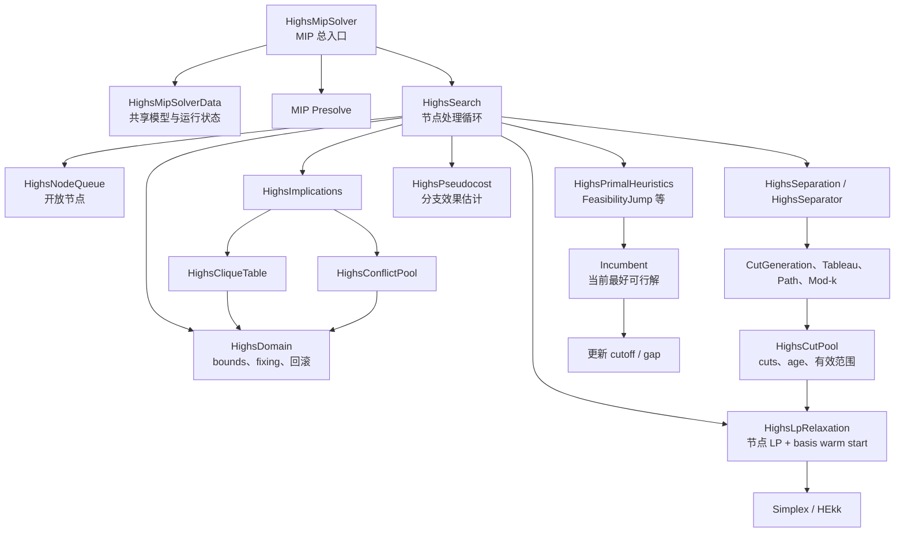

### 节点处理循环

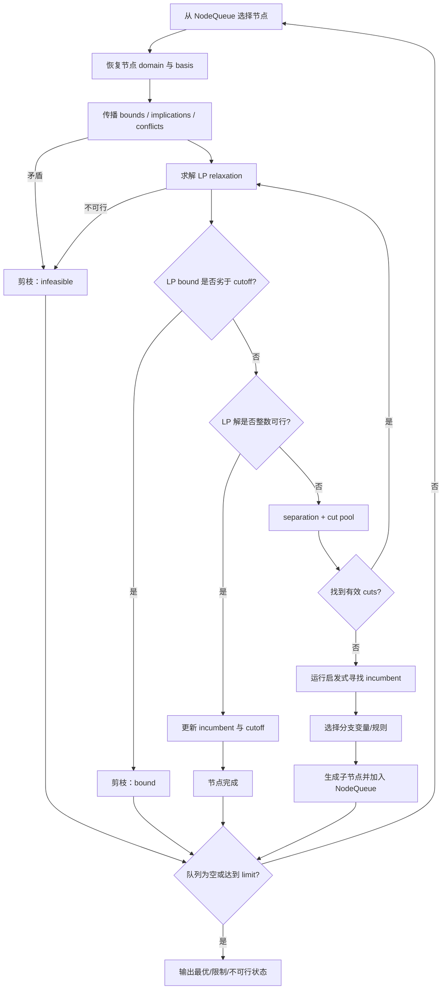

### MIP 中的数据边界

- `HighsDomain` 负责当前变量界及其修改历史，是 propagation 和回溯的共同基础。
- `HighsLpRelaxation` 负责 LP 行列、basis 与 cut 进入 LP 的状态。
- `HighsCutPool` 保存候选/活动 cuts，不等同于基础模型矩阵。
- `HighsPseudocost` 保存分支历史数据；具体分支选择在搜索逻辑中使用。
- clique、implication、conflict 相互提供推理信息，并可产生 bound tightening 或 cuts。
- primal heuristics 可以提交 incumbent，但不能改变有效下界证明。

## 8. IPM、PDLP 与 QP 子系统

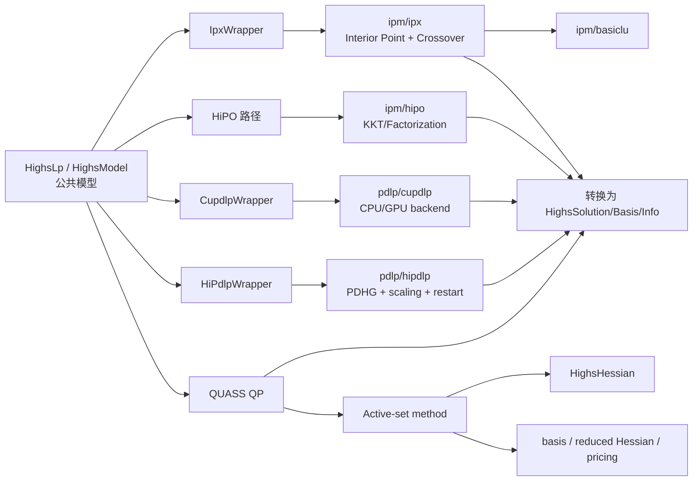

- IPM 的核心是 KKT 线性系统和 barrier 迭代；crossover 用于得到 basic solution。
- PDLP/PDHG 依靠矩阵向量乘、scaling、步长和 restart，适合大规模稀疏 LP，但不天然给出 basis。
- QUASS 是 convex QP active-set 方法，围绕 active constraints、reduced gradient 和 Hessian 工作。
- 不同算法最后都必须适配相同的 `HighsModelStatus`、`HighsSolution` 和 `HighsInfo` 语义。

## 9. 文件 I/O 与语言接口

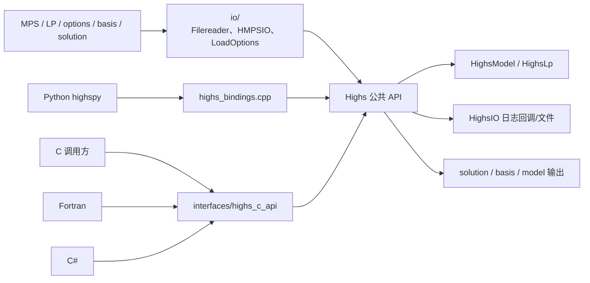

接口层最终汇聚到同一个 `Highs` 对象。文件 reader 负责把外部格式转换成内部模型，C API
负责把指针/长度参数转换成 C++ API；Python 再通过绑定层公开类和数组视图。

## 10. 横切模块：日志、回调、统计与并行

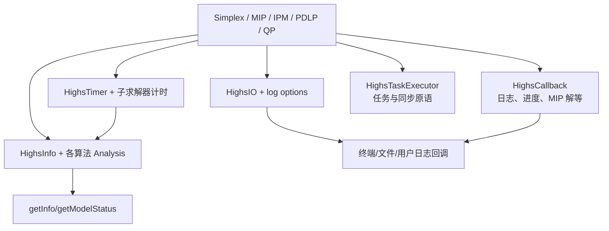

这些能力跨越所有求解器。移植时应避免让日志、统计和回调反向拥有算法状态；它们应消费
只读 snapshot 或明确的数据事件。

## 11. 当前结构的关键依赖特征

### 11.1 `lp_data` 并不是纯数据层

它包含 `Highs.cpp`、`HighsInterface.cpp` 和 `HighsSolve.cpp`，因此同时知道 presolve、MIP、
Simplex、IPM、PDLP、QP 和 I/O。理解总体控制流必须从这里开始。

### 11.2 `util` 存在算法级组件

`HighsSparseMatrix` 甚至包含 Simplex 结构相关依赖，`HFactor` 则是 basis LU 的核心实现。
因此 zhighs 不应复制一个无边界 `util/`，而应拆成 `foundation/matrix/nla`。

### 11.3 MIP 深度依赖 Simplex

MIP 节点需要频繁修改 bounds、加入 cuts 并重求 LP。可复用 basis 的 dual simplex 是这种
重优化的关键，因此 Simplex 是 zhighs MIP 路线的前置依赖。

### 11.4 Presolve 不只是删除行列

每个 reduction 都会改变变量/约束空间。没有完整 postsolve，就无法可靠恢复 dual、basis、
ray 或 certificate。预处理和后处理必须作为同一功能实现。

### 11.5 求解器共享结果语义

所有算法最终都回写公共 solution、basis、info 和 model status。算法适配层必须统一处理：

- primal/dual validity；
- iteration counts 和子求解器时间；
- optimal/infeasible/unbounded/unknown/limit 状态；
- basis 是否存在、是否一致；
- KKT 和一般 HiGHS 容差是否满足。

## 12. 推荐的源码阅读顺序


这个顺序先建立总控和公共数据语义，再进入 LP 数值内核，最后阅读建立在 LP 之上的 MIP
组件；可以避免一开始陷入单个 cut 或 factorization 文件而不了解其调用上下文。
