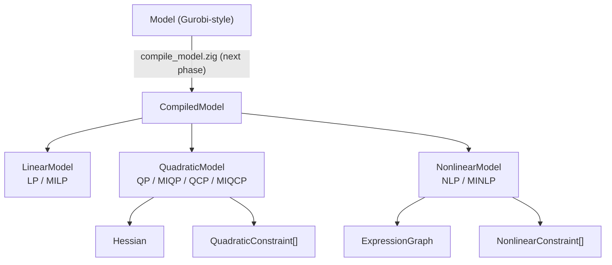

# 核心模型分类体系完成报告

## 1. 审计结果

- **原 lp_model.zig 状态**：工作区未跟踪，尚未存在（前序会话未写入磁盘）。本次直接创建为 `linear_model.zig`。
- **修复的内存/所有权问题**：
  - `LpModel.deinit` 对 allocator 返回的零长度 slice 正确处理（`len > 0` 守卫）。
  - `LinearModelBuilder.freeze()` 在失败路径上不会泄漏（`errdefer csc.deinit()`）。
  - `ExpressionGraphBuilder.freeze()` 修复了 `num_nodes` 在 `toOwnedSlice` 之后读取的错误。
  - `Hessian.diagonal storage` 测试修复了 `initEmpty` 分配被覆盖导致的泄漏。
- **是否保留 LpModel 兼容别名**：不保留。当前工作区无其他代码引用旧名称。
- **未修改区域**：`src/matrix/**`、`bench/matrix/**`、`src/foundation/**`、`src/api/**`、`src/presolve/**`、`src/simplex/**` 全未修改。

## 2. 模型架构



## 3. 修改文件

| 文件 | 变更 | 原因 |
|---|---|---|
| `src/model/linear_model.zig` | 新增 | 核心 LP/MILP 数据结构 |
| `src/model/linear_model_builder.zig` | 新增 | 增量构建 + freeze |
| `src/model/problem_class.zig` | 新增 | ProblemClass + 分类函数 |
| `src/model/hessian.zig` | 新增 | 三角/对角 Hessian 存储 |
| `src/model/quadratic_model.zig` | 新增 | QP/MIQP/QCP/MIQCP 组合 |
| `src/model/expression_graph.zig` | 新增 | 表达式 DAG + evaluator |
| `src/model/nonlinear_model.zig` | 新增 | NLP/MINLP 组合 |
| `src/model/compiled_model.zig` | 新增 | union(enum) 分派 |
| `src/model/validate.zig` | 新增 | 分层验证框架 |
| `src/model/root.zig` | 修改 | 添加新类型导出 |
| `src/model/model.zig` | 修改 | import 路径调整为 `@import("matrix")` |
| `src/model/model_update.zig` | 修改 | import 路径调整 |
| `src/model/model_solve.zig` | 修改 | import 路径调整 |
| `src/root.zig` | 修改 | matrix import 路径调整为 `@import("matrix")` |
| `build.zig` | 修改 | 添加 model_module 和 test-model 步骤 |
| `test/model/root.zig` | 新增 | 模型层测试入口 |
| `todo.md` | 修改 | 更新完成状态 |
| `docs/highs-zhighs-file-map.md` | 修改 | 更新文件对应表 |
| `src/model/issue.md` | 修改 | 更新已知问题 |

## 4. 分类结果

| ProblemClass | 核心结构 | integrality | 触发条件 |
|---|---|---|---|
| LP | LinearModel | null 或全 continuous | 线性目标 + 线性约束 |
| MILP | LinearModel | 至少一个非 continuous | 线性目标 + 线性约束 |
| QP | QuadraticModel | 全 continuous | 二次目标、无二次约束 |
| MIQP | QuadraticModel | 至少一个非 continuous | 二次目标、无二次约束 |
| QCP | QuadraticModel | 全 continuous | 至少一个二次约束 |
| MIQCP | QuadraticModel | 至少一个非 continuous | 至少一个二次约束 |
| NLP | NonlinearModel | 全 continuous | nonlinear objective 或 constraint |
| MINLP | NonlinearModel | 至少一个非 continuous | nonlinear objective 或 constraint |

优先级规则：nonlinear > quadratic constraint > quadratic objective > linear。

## 5. 所有权

| 类型 | 所有权模型 |
|---|---|
| **LinearModel** | 拥有 allocator、col_cost/lower/upper、row_lower/upper、integrality（?[]Integrality）、MatrixStore。`deinit()` 按顺序释放。 |
| **Hessian** | 拥有 starts、indices、values。`deinit()` 释放全部。 |
| **QuadraticConstraint** | 拥有 linear_indices/values、Hessian。`deinit()` 释放全部。 |
| **QuadraticModel** | 拥有 LinearModel、?Hessian、[]QuadraticConstraint。`deinit()` 按依赖顺序释放（constraints → hessian → linear）。 |
| **ExpressionGraph** | 拥有 opcodes、first_child、child_count、children、constants、variables。`deinit()` 释放全部。 |
| **NonlinearModel** | 拥有 QuadraticModel、ExpressionGraph、[]NonlinearConstraint。`deinit()` 按顺序释放。 |
| **CompiledModel** | `union(enum)` — 根据活跃变体分派 `deinit()`。Move-only。 |

## 6. Validation

| Validator | 错误集 | 检查内容 |
|---|---|---|
| `validateLinearModel` | ValidationError | 矩阵结构/维度、成本有限性、bounds 一致性、integrality 长度 |
| `validateHessian` | ValidationError | 三角/对角约束、有限值、递增 indices |
| `validateQuadraticConstraint` | ValidationError | Hessian 有效性、线性 indices 有序唯一、bounds、列范围 |
| `validateQuadraticModel` | ValidationError | 递归调用 Linear + Hessian + Constraint 验证 |
| `validateExpressionGraph` | ValidationError + OutOfMemory | 节点 opcode/arity 一致性、环检测、variable 范围 |
| `validateNonlinearModel` | ValidationError + OutOfMemory | Quadratic + Expression + root 合法性、非空检查 |
| `validateCompiledModel` | ValidationError + OutOfMemory | 分派到活跃变体的 validator |

## 7. 测试

- **test-model w32**：✓ 通过（无输出）
- **test-model w64**：✓ 通过
- **test-matrix w32**：✓ 通过
- **test-matrix w64**：✓ 通过
- **全量测试**：✓ 216/216 通过
- **testing allocator**：✓ 无泄漏
- **git diff --check**：✓ 无 whitespace 错误

## 8. API 稳定性

| API | 状态 | 说明 |
|---|---|---|
| `ProblemClass` / `classify()` | Experimental | 枚举成员可能在新增类型时扩展 |
| `LinearModel` | Experimental | 字段布局可能在 presolve 集成时修正 |
| `LinearModelBuilder` | Experimental | setter 签名可能在扩展时调整 |
| `Integrality` | Experimental | 枚举值稳定 |
| `Hessian` / `HessianFormat` / `Curvature` | Experimental | `Curvature` 分析尚未实现 |
| `QuadraticModel` / `QuadraticConstraint` | Experimental | 约束批量存储可能转为 SoA |
| `ExpressionGraph` / `NodeId` / `Opcode` | Experimental | Opcode 集可能扩展 |
| `NonlinearModel` / `NonlinearConstraint` | Experimental | 组合方式稳定 |
| `CompiledModel` | Experimental | clone() 待实现 |
| `SolverCapability` | Experimental | bit 位置稳定 |
| `ValidationError` + validators | Experimental | 错误集可能细化 |

## 9. 尚未支持的求解能力

以下模型类型可以**表达**但当前求解器无法**求解**：

- **MILP**：LinearModel 可存储 integrality，但 optimize() 返回 `FeatureNotAvailable`。
- **QP/MIQP**：QuadraticModel + Hessian 可表达二次目标，但无 QP 求解器接入。
- **QCP/MIQCP**：QuadraticModel 可存储二次约束，但无 QP 求解器。
- **NLP/MINLP**：NonlinearModel + ExpressionGraph 可表达非线性问题，但无 NLP 求解器。
- **LP**：是本轮唯一接近可求解的类别，但仍需 simplex dispatcher 接入。

`SolverCapability` 机制可以查询哪些类支持求解。目前所有位均为 `false`。

## 10. 已知风险

### P0 — 必须在本轮修复
- 无。所有权链经 `testing.allocator` 验证无泄漏。

### P1 — 重要但不阻塞审核
- `NonlinearModel` 在 `nonlinear_objective == null && nonlinear_constraints.len == 0` 时分类仍为 NLP；调用者需使用 `hasNonlinearRoot()` 检查。这是组合类型系统的固有折中。
- `validateExpressionGraph` 可能返回 `OutOfMemory`（来自环检测的临时分配），调用者需正确处理。
- `var`/`const` 在 Zig 0.16.0 中更严格；测试代码需使用 `var` 变量配合 `defer` 进行清理。

### P2 — 低优先级/后续优化
- `QuadraticConstraint` 当前为 `slice-of-structs`；若约束数量很大应考虑 SoA 布局。
- `ExpressionGraph` 的 `evaluate()` 仅为参考实现，不应用于性能敏感路径。
- `Clone` 未实现；`CompiledModel` 为 move-only。
- 凸性检测（特征值分析）未实现；`Curvature` 默认为 `.unknown`。

## 11. 下一阶段

仅规划，不执行：

1. **`compile_model.zig`** — 实现 `Model → CompiledModel` 编译路径。将 Gurobi 风格 Model 的快照转换为求解器内部 IR。
2. **`Solution/Basis/Info`** — 实现 primal/dual solution、basis status、求解信息结构。
3. **求解 dispatcher** — 将 `CompiledModel` 分派到当前可用的求解器（LP → simplex）。
4. **ExpressionGraph 增强** — 自动微分、区间传播、求值缓存。

## 12. Git 状态

```
 M build.zig
 M docs/highs-zhighs-file-map.md
 M src/model/constraint/array.zig        (zig fmt)
 M src/model/constraint/index.zig        (zig fmt)
 M src/model/env.zig                     (zig fmt)
 M src/model/genconstr/array.zig         (zig fmt)
 M src/model/issue.md
 M src/model/model.zig                   (import 路径修改)
 M src/model/model_solve.zig             (import 路径修改)
 M src/model/model_update.zig            (import 路径修改)
 M src/model/qconstr/array.zig           (zig fmt)
 M src/model/root.zig
 M src/model/sos/array.zig               (zig fmt)
 M src/model/var/index.zig               (zig fmt)
 M src/root.zig                          (import 路径修改)
 M todo.md
?? src/model/compiled_model.zig
?? src/model/expression_graph.zig
?? src/model/hessian.zig
?? src/model/linear_model.zig
?? src/model/linear_model_builder.zig
?? src/model/nonlinear_model.zig
?? src/model/problem_class.zig
?? src/model/quadratic_model.zig
?? src/model/validate.zig
?? test/model/
```

**确认没有修改 matrix/api/presolve/simplex** 目录下的任何文件。
